# Flows

This document contains Mermaid diagrams that describe the main data flows in LinkVault.

## Upload Flow
```mermaid
flowchart LR
  U[User Browser]
  FE[Frontend (React/Vite)]
  API[Express API]
  MUL[Multer]
  FS[(Disk /uploads)]
  DB[(MongoDB)]

  U <--> FE
  FE -- POST /api/upload (FormData) --> API
  API -- multer.single('file') --> MUL
  MUL -- write --> FS
  API -- save metadata --> DB
  FE <-- JSON {url, contentId} -- API
```

## View + Download Flow

```mermaid
sequenceDiagram
  participant B as Browser
  participant F as Frontend
  participant A as API (Express)
  participant D as MongoDB
  participant S as Disk (/uploads)

  B->>F: Open /view/:id
  F->>A: POST /api/content/:id {password?}
  A->>D: load content (+policy checks)
  A-->>F: 200 {data} or 401/404/410
  alt file content
    B->>A: GET /api/download/:id
    A->>D: enforce one‑time/max views (increment on download)
    A->>S: stream file
    A-->>B: 200 attachment
  end
```


